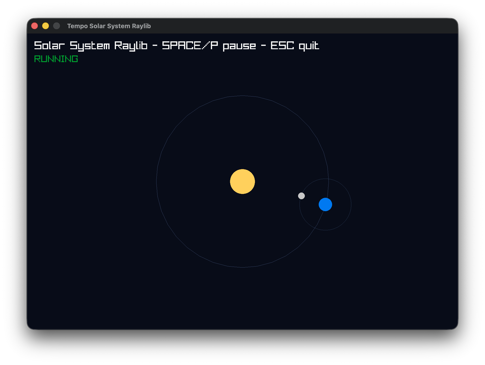
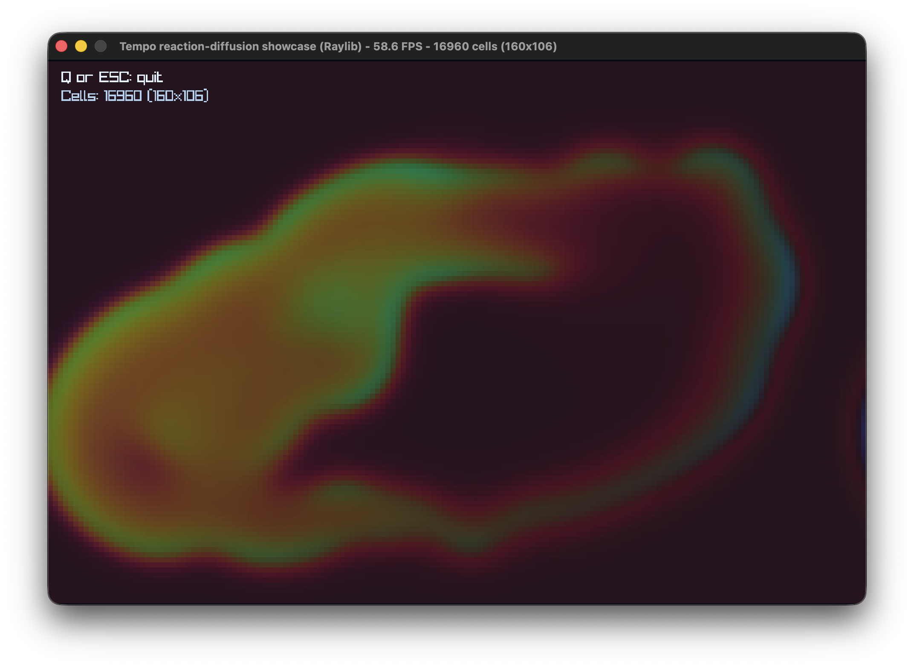
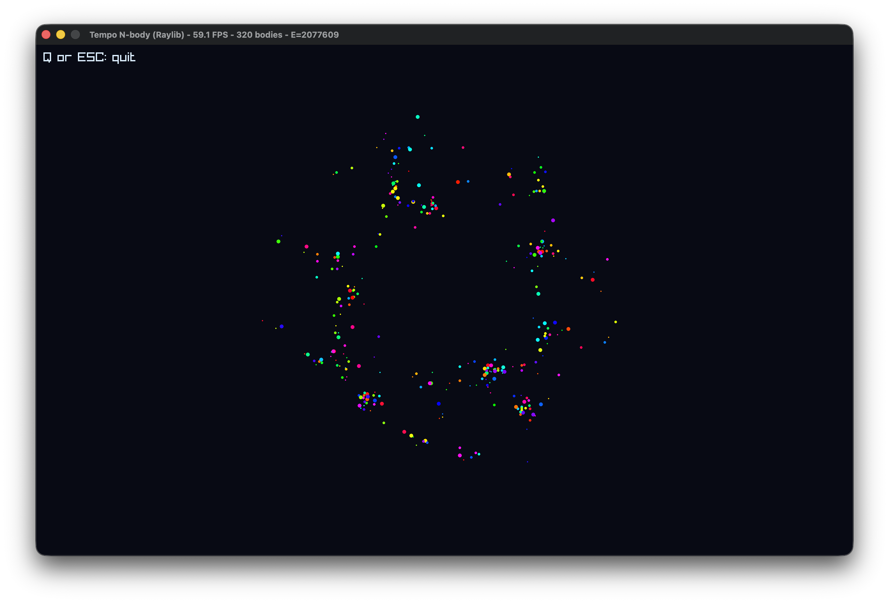
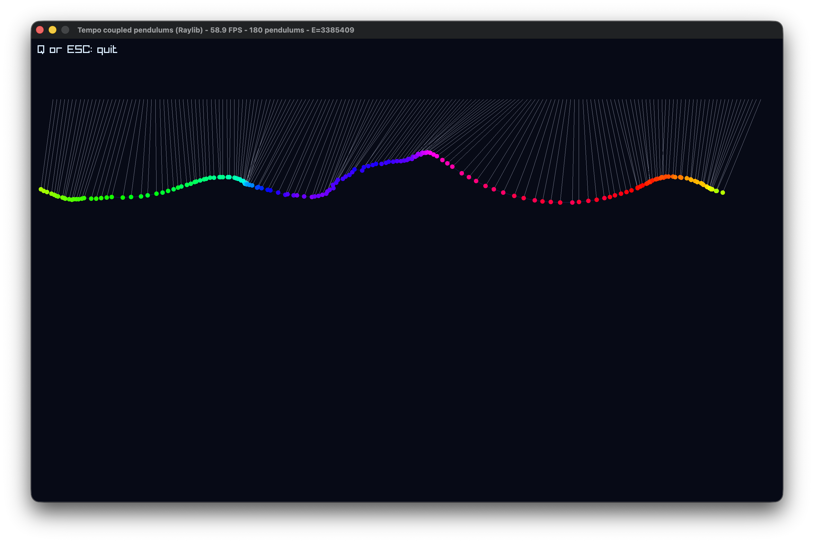
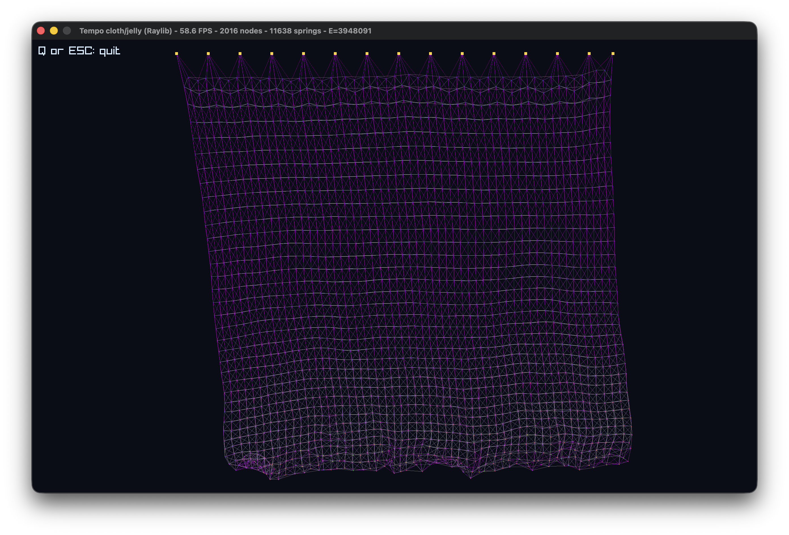
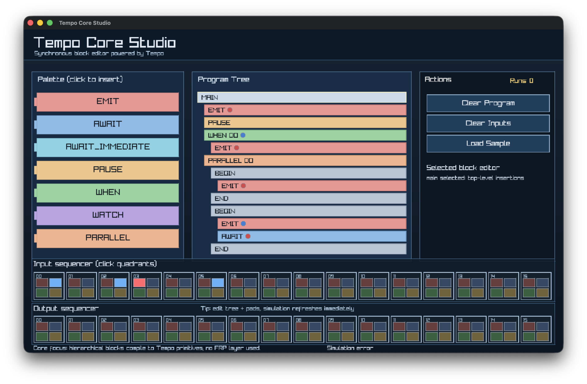
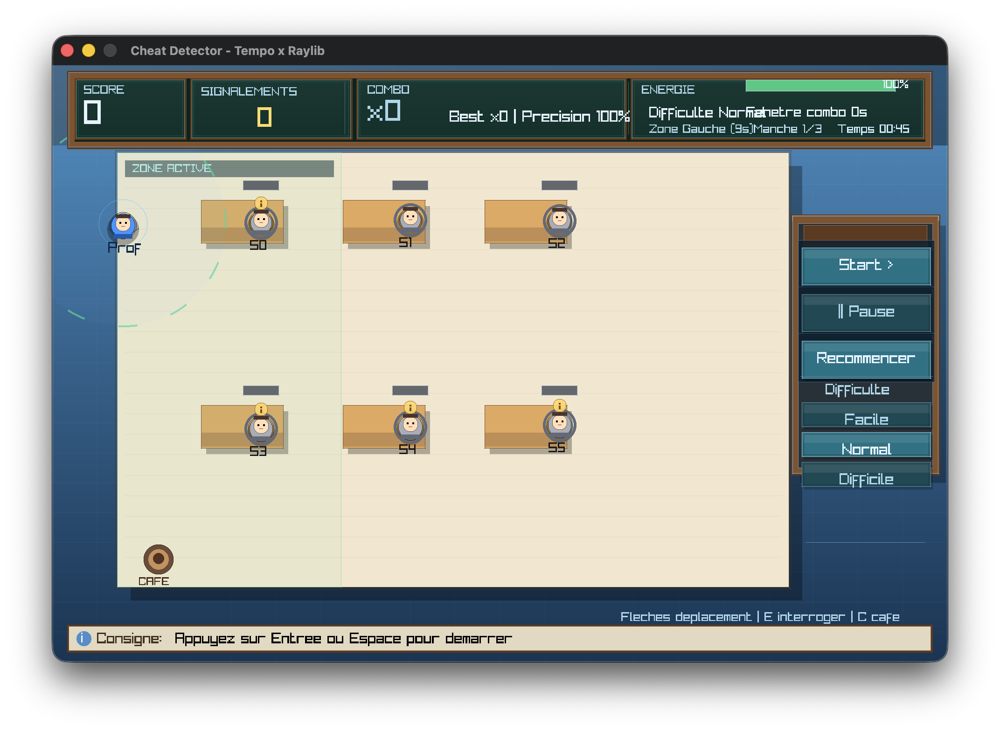
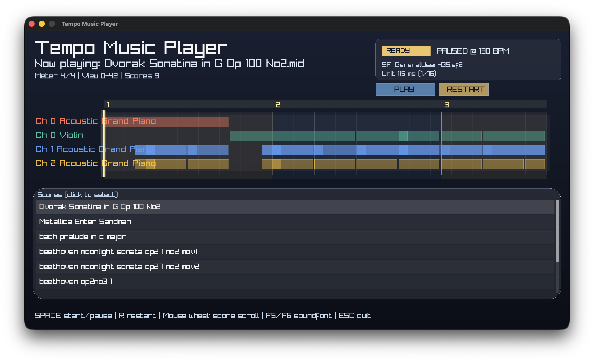

# Tempo

A lightweight synchronous runtime inspired by Esterel, Boussinot’s FairThreads, and ReactiveML.
All three are grounded in the idea that deterministic concurrency can be made tractable by discretizing time into logical instants, during which all components react to the signals emitted in that instant. In Esterel, the absence of a signal is decided immediately, which enforces a static scheduling discipline and consequently rules out many forms of dynamic behavior. FairThreads addressed this limitation by postponing the observation of absence until the end of the instant, thereby enabling more flexible execution patterns. ReactiveML carried these ideas into OCaml, retaining Boussinot’s delayed-absence semantics while enriching the model with higher-order programming constructs. Tempo keeps that “reaction delayed to absence” principle while leveraging OCaml 5 effects to experiment with modern implementations.

## Table of contents

- [Programmation model](#programming-model)
  - [Instants and execution model](#instants-and-execution-model)
  - [Fundamental primitives](#fundamental-primitives)
  - [Construct primitives](#construct-primitives)
  - [Control helpers](#control-helpers)
- [Install, build and test](#installation-and-build)
  - [Installation](#installation)
  - [Build](#build)
  - [Run tests](#run-tests)
  - [Documentation](#documentation)
- [Demos](#demos)
  - [Run applications](#run-applications)
  - [Advanced applications: dependencies and Tempo libraries](#advanced-applications-dependencies-and-tempo-libraries)
  - [Run sample applications](#run-sample-applications)
- [Quick start]
  - [Create and run your own Tempo application](#create-and-run-your-own-tempo-application)
  - [Logging and runtime flags](#logging-and-runtime-flags)
- [Application screenshots](#application-screenshots)

---

## Programming model

### Instants and execution model

A Tempo program executes over a sequence of logical instants. It supports synchronous parallel composition of behaviors that communicate through valued signals. At each instant, a signal is either present or absent. A signal is present if and only if a value is provided by the environment or emitted by the program during that instant.
The absence of a signal can be observed only once the instant has completed. Observers may then react in the following instant. This delayed observation of absence is the key mechanism that preserves determinism.
Tempo supports guarded execution and weak preemption, allowing behaviors to be conditionally activated and preempted without violating the synchronous execution model.

---

### Fundamental primitives

Tempo manipulates signals that carry values during a logical instant. Two kinds of signals are supported:

- **Event signals**: created with `new_signal ()`, accept at most one emission per instant.
- **Aggregate signals**: created with `new_signal_agg ~initial ~combine`, may accumulate multiple emissions within a single instant by folding successive values using the provided combine function.

Reactive programs are built from seven primitive operations:

- **`emit signal value`** marks signal as present in the current instant and delivers value. All tasks waiting on the signal are resumed, either immediately or at the next instant, depending on how they were suspended.
- **`await signal`** suspends the current task until signal becomes present. The continuation always resumes at the beginning of the next instant, receiving the value carried by the signal.
- **`await_immediate` signal** behaves like await, except that if the signal is already present, the continuation resumes within the same instant. To preserve determinism, await_immediate is restricted to event signals, which allow at most one emission per instant.
- **`pause ()`** suspends the current task and schedules it for execution in the next instant.
- **`parallel [p1; …; pn]`** executes all programs in the list concurrently within the same instant.
- **`when_ guard body`** executes body only if guard is present in the current instant. Otherwise, the task is blocked and automatically resumes when the guard becomes present.
- **`watch signal body`** executes body until signal is emitted. Such an emission causes body to be terminated at the end of the current instant, implementing weak preemption.

--- 
### Construct primitives

High-level reactive operators are available under `Tempo.Constructs`.

These constructs are built on top of the seven fundamental primitives.

- `present_then_else s then_ else_` — run `then_` if `s` is present in the current instant, otherwise run `else_` in the next instant.
- `after_n n body` — wait `n` logical instants, then run `body`.
- `every_n n body` — run `body` every `n` logical instants forever.
- `timeout n ~on_timeout body` — run `body` under weak preemption, cancel it after `n` instants, then run `on_timeout`.
- `cooldown n s body` — run `body` when `s` is observed, then ignore subsequent occurrences for `n` instants.
- `supervise_until stop body` — alias for a weak preemption scope (`watch stop body`).
- `pulse_n n` — create a unit signal that is emitted periodically every `n` instants.

Example:

```ocaml
open Tempo

let heartbeat = Constructs.pulse_n 10
```

---

### Control helpers

A few helpers are built on top of the primitives and available under `Tempo.Constructs`:

- `loop f` — repeat `f` forever with a `pause` between iterations.
- `idle` — a `pause`-forever process.
- `control toggle proc` — start/stop `proc` each time `toggle` is emitted (starts stopped).
- `alternate toggle proc_a proc_b` — run `proc_a` immediately, then switch between `proc_a` and `proc_b` on each `toggle` emission.

---

## Installation and build

### Installation

Requirements:

- OCaml >= 5.3
- dune >= 3
- opam (recommended)

From the repository root:

```sh
opam install . --deps-only --with-test --with-doc
```

If you want to pin this local checkout:

```sh
opam pin add tempo . --no-action
opam install . --deps-only --with-test --with-doc
```

Optional packages used by graphical applications:

```sh
opam install raylib
opam install ./tempo-raylib.opam --deps-only
opam install ./tempo-fluidsynth.opam ./tempo-score.opam --deps-only
brew install fluid-synth   # macOS (needed for tempo-fluidsynth / music_score_player)
```

---

### Build

Build everything:

```sh
dune build
```

Build only the public library/installable targets:

```sh
dune build @install
```

---

### Run tests

Run the full test suite:

```sh
dune runtest
```

Equivalent shorthand:

```sh
dune test
```

Run a single test executable:

```sh
dune exec tests/ok/emit_once_await_one.exe
```

---

## Documentation

Generate API documentation:

```sh
dune build @doc
```

Open the generated documentation index:

```sh
open _build/default/_doc/_html/index.html      # macOS
xdg-open _build/default/_doc/_html/index.html  # Linux
```

The Tempo library entry page is:

```text
_build/default/_doc/_html/tempo/index.html
```

---

## Demos

### Run applications

From repository root, use the project switch first:

```sh
eval $(opam env --switch 5.4.1+options --set-switch)
```

Then launch simple demos:

```sh
sh applications/simple-demos/ca-continuous-raylib/run
sh applications/simple-demos/cloth-raylib/run
sh applications/simple-demos/nbody-raylib/run
sh applications/simple-demos/pendulums-raylib/run
sh applications/simple-demos/solar-system-raylib/run
```

Launch advanced applications:

```sh
sh applications/advanced/game-univ/run
sh applications/advanced/tempo-core-studio/run
sh applications/advanced/music_score_player/run
```

---

### Advanced applications: dependencies and Tempo libraries

For advanced apps, install the runtime stack once:

```sh
opam install raylib
opam install ./tempo-raylib.opam --deps-only
opam install ./tempo-fluidsynth.opam ./tempo-score.opam --deps-only
brew install fluid-synth   # macOS
```

If you want the Tempo libraries installed in your switch as opam packages:

```sh
opam pin add tempo . --no-action
opam pin add tempo-raylib . --no-action
opam pin add tempo-fluidsynth . --no-action
opam pin add tempo-score . --no-action
opam install tempo tempo-raylib tempo-fluidsynth tempo-score
```

---

## Quick start

### Create and run your own Tempo application

In your dune file:

```lisp
(executable
 (name my_app)
 (libraries tempo))
```

In your OCaml file:

```ocaml
open Tempo

let program _input _output =
  let s = new_signal () in
  parallel [
    (fun () ->
       let v = await s in
       Format.printf "received %d@." v);
    (fun () -> emit s 42)
  ]

let () = execute program
```

Run it:

```sh
dune exec path/to/my_app.exe
```

---

### Logging and runtime flags

Tempo supports runtime logging with CLI flags and environment variables.

CLI:

- `--log-level debug|info|warning|error|quiet`

Environment variables:

- `RML_LOG_LEVEL=debug|info|warning|error|off`
- `RML_LOG_COLOR=0|1` (disable/enable ANSI colors)
- `RML_TRACE_GUARDS=0|1` (extra guard tracing)

Example:

```sh
RML_LOG_LEVEL=debug RML_TRACE_GUARDS=1 dune exec samples/awaiters_log.exe
```

---

## Application screenshots

### Simple demos

`solar-system-raylib`  


`ca-continuous-raylib`  


`nbody-raylib`  


`pendulums-raylib`  


`cloth-raylib`  


### Advanced applications

`tempo-core-studio`  


`game-univ`  


`music-score-player`  

